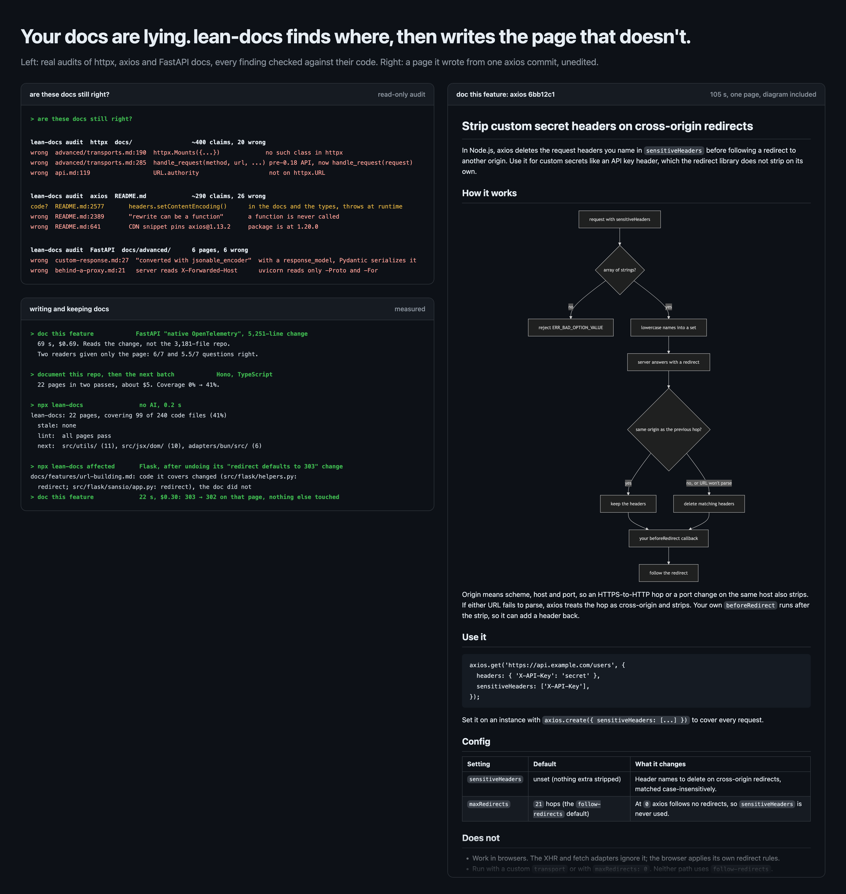
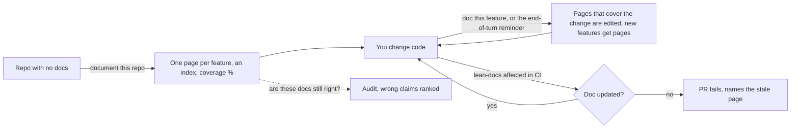

# lean-docs

**Your docs are lying. lean-docs finds where, then writes the page that doesn't.**

lean-docs is a skill for Claude Code, Codex, Cursor and any agent that reads `SKILL.md` (tested with Claude Code and Codex). It checks every claim in your docs against the code. It writes one page per feature for a new teammate: about 650 words with a diagram, a 3-minute read. And it tells you which docs went stale when the code changed.



## Install

```bash
npx skills add seifguerbouj/lean-docs
```

That copies the skill into your project: `.claude/skills/lean-docs/` for Claude Code, `.agents/skills/lean-docs/` for Codex (pick with `-a claude-code` or `-a codex`). The CLI also offers other agents that read `SKILL.md`, such as GitHub Copilot and Zed; those are untested.

Or as a Claude Code plugin, which adds the end-of-turn hook and five commands (`/lean-docs:doc`, `/lean-docs:audit`, `/lean-docs:bootstrap`, `/lean-docs:coverage`, `/lean-docs:publish`):

```
/plugin marketplace add seifguerbouj/lean-docs
/plugin install lean-docs@lean-docs
```

Or as a Codex plugin:

```bash
codex plugin marketplace add seifguerbouj/lean-docs
codex plugin add lean-docs@lean-docs
```

### What runs where

lean-docs has two parts:

| Part | Where it runs | Uses AI? | What it does |
|---|---|---|---|
| **The skill** (plugin or `skills add`) | inside Claude Code, Codex or another agent | yes, your agent and your subscription | writes pages, checks claims against the code, rewrites pages for the wiki |
| **The script** (`lean-docs.mjs`) | anywhere Node 18+ runs | no, and it costs no tokens | finds stale pages, lints, measures coverage, builds the wiki view |

The skill brings its own copy of the script and runs it for the mechanical steps, so inside an agent you need nothing else. `npx lean-docs` runs the same script without an agent, for CI, pre-commit hooks, a teammate's terminal or a status line. It can tell you which page a change made stale and who owns it. Writing or fixing the page takes the agent.

## Tested on real projects

Python (including a Django app), TypeScript (including a pnpm monorepo and a Next.js app), Go, Rust, Java, Kotlin, Swift, Dart, C, C++, C#, Ruby (a Rails app) and PHP. Every finding below was checked by hand against the project's code; clone the commit and see for yourself.

| Project | What lean-docs did | What it found |
|---|---|---|
| [httpx](https://github.com/encode/httpx) `b5addb6` | audited all of `docs/`: 23 pages, about 400 claims, 2 min 32 s, $1.53 | 20 wrong. `httpx.Mounts` doesn't exist, and the API reference lists `Response.next()` and `URL.authority`, which don't either. |
| [axios](https://github.com/axios/axios) `2b169bb` | audited `README.md` | 26 wrong. `headers.setContentEncoding()` is in the README and the types, but throws at runtime. |
| [FastAPI](https://github.com/fastapi/fastapi) `4b3949c` | **doc this feature** on native OpenTelemetry, a 5,251-line change | [This page](examples/fastapi-opentelemetry.md), unedited, in 69 s for $0.69. Two readers given only the page scored 6/7 and 5.5/7 on 7 questions written from the code (2026-10-08). Both caught that gRPC and a missing SDK extra fail at startup. Both said the per-signal export URL isn't in the page. |
| [Cobra](https://github.com/spf13/cobra) `adbc881` (Go) | **document this repo** | 12 pages, coverage 0% → 100%, $3.36. Cobra's own site says to call `SetHelpCommandGroupId()`; it's `SetHelpCommandGroupID`, so the example doesn't compile. |
| [Gson](https://github.com/google/gson) `845664b` (Java) | **document this repo** | 18 pages in under 6 minutes for $6.86, coverage 0% → 83%, all 18 diagrams parse. Gson's user guide says inner classes can't be serialized by default; `serializeInnerClasses` defaults to `true`. |
| Hono, Flask, Cobra and Campfire (Ruby), their generated pages | **keeping them true**: five code changes, four of them real fixes reverted | `affected` named the right page every time, with no AI. Once it also named a neighbouring page, which the agent checked and left alone. In a Rails model, a page naming `memberships` also matched an edit that only calls it. On 30 ordinary Hono commits it raised 9 flags, 4 of them real; the other 5 were comment, type or small-detail edits. On 30 Cobra commits, under pages covering all its code, it missed no stale page; 13 of its 67 flags were real. **doc this feature** fixed only the untrue lines, in under 40 s for under $0.45. |
| Hono and Flask, 46 generated pages | **audit of lean-docs' own output** | About 98% right: 26 of about 1,220 claims wrong. 11 of 12 Hono examples type-check and run. [How accurate it is](docs/reference.md#how-accurate-it-is). |

[More results](docs/reference.md#more-results): Flask, Hono, ripgrep, FluentValidation, Moshi, Alamofire, hiredis and umami bootstraps, Guzzle (PHP) and FastAPI audits, and a tRPC change whose own guide was wrong. Also an httpx bootstrap and trim, a private app with a few hundred source files, and a Vite page it found accurate.



## What you get

- **One page that explains.** A plain-language opening and a mermaid diagram of how it works, error path included. Then the common call, what it *doesn't* do, and a symptom → cause → check table for when it breaks. The shape follows [Google's and GitLab's doc practices](docs/reference.md#why-this-shape).
- **Docs that are true.** Every claim is checked against the code, and code examples are claims too. "Are these docs still right?" is a read-only audit that ranks the wrong claims by danger. When a change ships its own guide, "doc this feature" checks that guide too.
- **Docs that stay true.** Each page lists the files it covers, down to the functions when a big file is shared. `npx lean-docs affected` tells you which docs a change made stale, and the GitHub Action says so in a PR comment. It needs no AI and takes 0.09 s on axios. Docs you already have, like a README or a tutorial, can be tracked too: one hidden line, `[//]: # (lean-docs-code: src/client.py send)`, ties them to the code without changing them. Docs with neither a Code table nor that line aren't tracked.
- **A wiki for everyone else.** The same pages, rebuilt for people who don't read code and published to Confluence, Notion or a docs site. See [Share with your team](#share-with-your-team).

## How docs grow



1. **Start.** "Document this repo" maps the repo from its file list, README and git history, without reading all the code. It proposes a feature list, then writes one page per feature, reading only that feature's files (with subagents in parallel on big repos). It finishes with an index and the coverage before and after.
2. **Grow.** As you build, "doc this feature" edits the pages that cover your change and adds pages for new features. Pages name exact identifiers, so agents find and fix them on their own. When they've been told to keep a change minimal they don't, and that's what the end-of-turn hook is for. In our test on 2026-10-08 ("a one-line edit", 5 runs each), the plugin's 5 runs all updated the page. Without it, 0 of 5 updated it and 0 of 5 were silent. All 5 named the page as stale and asked first; 3 named only 2 of the 3 stale lines.
3. **Keep.** `npx lean-docs affected --strict` fails a PR that changed code without its page, and `npx lean-docs coverage --min 70` fails one that drops coverage. Run "are these docs still right?" before a release.

## How it compares

| | lean-docs | DeepWiki | Mintlify | "Hey agent, write docs" |
|---|---|---|---|---|
| Where docs live | Your repo, plain markdown | deepwiki.com (hosted) | A hosted docs site, built from MDX in your repo | Your repo |
| Checks claims against the code | Yes: audit marks `wrong` and `code?` | Chat answers cite the code | Its agent can run scheduled audits | If you ask. Just as accurate in [our test](docs/reference.md#how-accurate-it-is) |
| Fails a PR when a doc goes stale | Yes, free script | No | No: its agent opens a docs PR after code merges | No |
| Works inside your coding agent | Claude Code and Codex (tested), any SKILL.md agent | Read-only, through MCP | A skill and MCP for writing its pages | Yes |
| Keeps each page short and readable | Yes, linted | Generated wiki | Your own format | No: twice the words, no diagrams |
| Price | Free, MIT. You pay your agent's tokens | Free for public repos; private through Devin | Free starter plan; automations on paid plans | Tokens |

Use DeepWiki to explore a repo you don't own. Use Mintlify for a hosted public docs site. Use lean-docs to keep your own repo's docs short and true, inside the agent you already code with. We asked a reader 15 questions from httpx, Cobra and Gson issues, giving it only one doc. It averaged 11.75 right from lean-docs pages and 5.25 from the projects' own doc sections, which are half as long ([test](docs/reference.md#how-accurate-it-is)).

## Your first 5 minutes

1. `npx lean-docs`, or `/lean-docs:coverage` in Claude Code, shows how many pages you have, how much code they cover, what's stale, and where the gaps are.
2. `/lean-docs:audit docs/` (read-only) shows which existing docs are wrong.
3. `/lean-docs:bootstrap` writes the first batch of pages for the biggest gaps.
4. Add the GitHub Action ([In CI](#in-ci)), so every PR keeps them true.

With `npx skills add`, say the same things in words: "docs coverage", "are these docs still right?", "document this repo".

## Use

Tell your agent:

| You say | It does |
|---|---|
| **document this repo** | Maps the repo, proposes features, writes one page each, an index, and the coverage before and after |
| **doc this feature** | Reads the diff and the code around it, then edits the pages it touches or writes a new one, in your repo's docs folder |
| **trim these docs** | Rewrites existing docs, checks every claim against the code, and lists what was `wrong` |
| **are these docs still right?** | Read-only audit: checks every claim in your docs against the code and lists the ones that are wrong, most dangerous first |
| **publish the docs to Confluence** | Builds a reader version of the pages (no code, an overview, a glossary, one troubleshooting page) and publishes it as a page tree. See below |

New pages, trims and bootstraps end with a cut list: what was cut and why, the claims the code contradicts (`wrong`), what was added, and the facts that were kept. Everyday edits get one line per page.

## Share with your team

**Preview.** Tested on Notion (a private page), Obsidian, plain folders and a stand-in for the Confluence connector. It hasn't been tried on a live Confluence space yet.

The repo pages are for engineers and agents. Product, support, ops and new joiners get a wiki built from them: same facts, no code.

```
/lean-docs:publish Confluence space DOCS under "Engineering"
/lean-docs:publish Notion page "Handbook", in German
/lean-docs:publish my Obsidian vault ~/Notes, folder "Our system"
/lean-docs:publish docs/handbook          (a Docusaurus or MkDocs folder)
```

In Codex or without the plugin, say "publish the docs to Confluence, space DOCS under Engineering".

What readers get:

```
<Your system>                      what it does end to end, with one diagram
├── Intake, Matching, Export …     one page per area, listing its features
│   └── <Feature>                  what it does, how it works, settings, limits, what to do when it fails
├── Glossary                       every term from every page, in one table
└── Troubleshooting                every known error message: likely cause, what to check
```

- **No code in the reader's part.** File names, functions and examples move to a "For engineers" section at the bottom of each page, with the path of the source page.
- **Plain language, any language.** The agent rewrites each page for the readers you pick (people who don't read code, engineers, or both) without adding a fact. It keeps every error message exactly, so people can search for it. Ask for German, French or another language and it translates.
- **Easy to keep current.** The wiki is generated from the repo pages, and every page says so. It doesn't update itself: `npx lean-docs` tells you when published pages are behind, and publishing again rewrites only the changed pages, in place.
- **Owners.** Name an owner per area in `docs/features/overview.md` (`- **Matching** (owner: Jana): ...`). The wiki shows it, and `affected`, the end-of-turn hook and the PR comment name the owner next to each stale page. `.lean-docs/publish.json` records the page ids; commit it so your team updates the same pages.
- **Obsidian too.** Point it at a vault folder: areas become folders, links become `[[links]]`, code folds away.
- **Diagrams.** Notion, Obsidian, Docusaurus, MkDocs, GitHub and GitLab draw them. Confluence needs a Mermaid app, and its connector can't upload images, so without one each diagram becomes a numbered step-by-step list.

Connect once:

| | Claude Code | Codex |
|---|---|---|
| Confluence | `claude mcp add --transport http atlassian https://mcp.atlassian.com/v2/mcp`, then `/mcp` to log in | `codex mcp add atlassian --url https://mcp.atlassian.com/v2/mcp`, then `codex mcp login atlassian` |
| Notion | `claude mcp add --transport http notion https://mcp.notion.com/mcp`, then `/mcp` | `codex mcp add notion --url https://mcp.notion.com/mcp`, then `codex mcp login notion` |

To see the reader version before publishing anything: `npx lean-docs wiki docs/features` writes it to `.lean-docs/wiki/`, with no AI and no connector.

## In CI

```yaml
permissions: { contents: read, pull-requests: write }
steps:
- uses: actions/checkout@v4
  with: { fetch-depth: 0 }
- uses: seifguerbouj/lean-docs@v0
  with: { paths: docs/features/*.md, fail-on-stale: true, min-coverage: 50 }
```

If a change didn't make a doc wrong (a rename, a refactor), add `lean-docs-ok: docs/features/x.md` to a commit message and the check passes. A PR with something to fix gets one comment, edited on each push. It lists the docs the PR made stale, the pages it updated, the coverage and its biggest gaps, and any lint problems. The same checks run locally with `npx lean-docs affected`, `npx lean-docs coverage` and `npx lean-docs check`, or as [pre-commit hooks](docs/reference.md#docs-that-keep-up-with-the-code). They need no AI and cost no tokens.

## More

This repo documents itself with lean-docs: [`docs/features/`](docs/features/README.md), checked by its own Action on every PR. [`docs/reference.md`](docs/reference.md) has the page shape, every CLI command, the linter rules, measured costs, where the output renders, and how it's tested. [`examples/`](examples/) has real pages written from [axios](examples/axios-sensitive-headers.md) and [FastAPI](examples/fastapi-opentelemetry.md) commits.

## License

MIT
