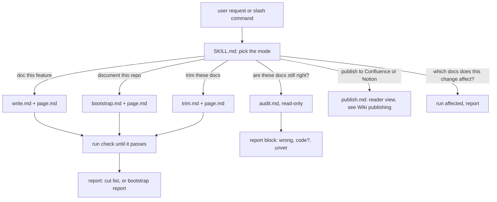

# Agent modes

The skill tells a coding agent how to write, bootstrap, trim, audit and publish one-page feature docs. The agent picks one mode from what the user says and reads only that mode's file, so each run loads a small set of instructions.

## How it works

`page.md` holds the page shape and writing rules that the linter enforces. Every mode that writes ends with `lean-docs check` passing and a cut list.

## Terms
| Term | Meaning |
|---|---|
| Cut list | the closing block listing what was cut, `wrong` claims, what was added and what was kept |
| `wrong` | a doc claim the code contradicts |
| `code?` | the doc matches types or tests but not the runtime, so a maintainer decides |
| `unver` | a claim the repo can't confirm |

## Config
| Setting | Default | What it changes |
|---|---|---|
| `/lean-docs:doc`, `:bootstrap`, `:audit`, `:coverage`, `:publish` | Claude Code plugin only | slash commands that load the skill and run one mode |
| Claude Code plugin | `/plugin marketplace add seifguerbouj/lean-docs`, then `/plugin install lean-docs@lean-docs` (on 2.1.275 or later, one step: `/plugin install lean-docs --marketplace seifguerbouj/lean-docs`) | skill, five commands and the end-of-turn hook |
| Codex plugin | `codex plugin marketplace add seifguerbouj/lean-docs`, then `codex plugin add lean-docs@lean-docs` | the skill; the end-of-turn hook is Claude Code only |
| Skill only, for other agents | `npx skills add seifguerbouj/lean-docs` | skill only, no hook and no commands |

## Does not
- Edit anything in audit mode. It only reports.
- Publish without asking. Publish mode confirms the space or parent page first.
- Treat changelogs, migration guides, release notes or ADRs as wrong because the code moved on.
- Rewrite a runbook, ADR or public guide into the page shape. Trim keeps its headings and checks it with `--keep-shape`.
- Edit untracked docs in trim mode without asking, because git is the undo.
- Rewrite a guide or README that a change ships. Write mode reports its `wrong` claims and edits it only if asked.

## Breaks when
| Symptom | Likely cause | Check |
|---|---|---|
| The agent writes a new page next to an existing one | it skipped `affected` | step 2 of `write.md` |
| A page claims something the code doesn't do | the agent wrote from memory or old docs | run audit mode on it |
| The diagram shows as code in Confluence | it was published as mermaid to a space without a Mermaid app | `publish.md` step 4 |
| A new page is missing from the MkDocs or Docusaurus menu, or its diagram shows as code | the site has an explicit `nav:` or sidebar, or no mermaid fence | step 4 of `write.md` |
| The commands are missing | installed as a skill, not as a plugin | install the plugin: `/plugin marketplace add seifguerbouj/lean-docs`, then `/plugin install lean-docs@lean-docs` |

## Code
| Where | What |
|---|---|
| `skills/lean-docs/SKILL.md` | the mode table, the CLI summary, and the rules for every mode |
| `skills/lean-docs/reference/page.md` | the page shape, diagram rules, writing rules, banned phrases, cut list format |
| `skills/lean-docs/reference/write.md` | doc this feature: steps from diff to checked page |
| `skills/lean-docs/reference/bootstrap.md` | document this repo: feature map, one page each, report format |
| `skills/lean-docs/reference/trim.md` | trim mode: claim checks and when to keep a doc's shape |
| `skills/lean-docs/reference/audit.md` | audit mode: the report block and how claims are checked |
| `commands/` | the five slash commands |
| `.claude-plugin/plugin.json` | plugin metadata |
| `.claude-plugin/marketplace.json` | marketplace entry for `/plugin marketplace add` |
