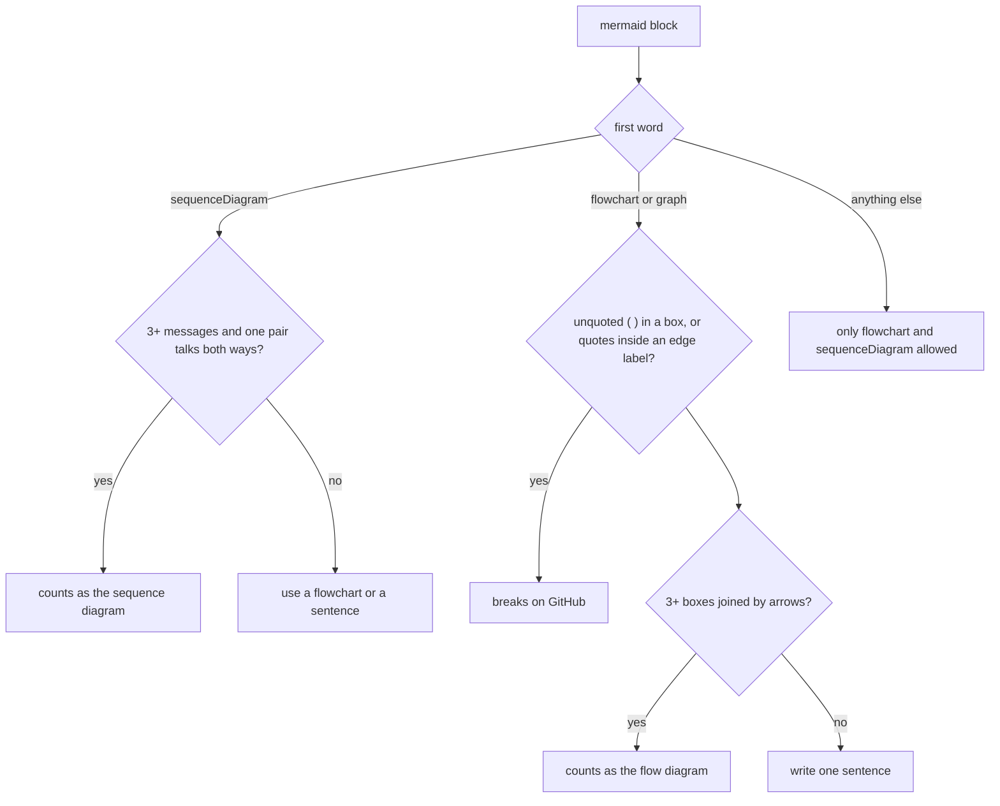

# Diagram checks

The doc linter parses every `mermaid` block and rejects diagrams that GitHub would fail to render or that explain nothing. It catches the two label mistakes that break a whole diagram on GitHub, without a browser.

## How it works

A diagram that passes also counts as the explanation for its section. `## How it works` needs one, or a numbered list. A page may hold one flowchart and one sequence diagram at most.

## Terms
| Term | Meaning |
|---|---|
| Box label | the text in `A[...]` or `A{...}` |
| Edge label | the text on an arrow, written between pipes after the arrow or as `-- label -->` |
| Back-and-forth | some participant sends to another and gets a message back |

## Does not
- Render the diagram. A syntax error other than the two label rules passes; `evals/diagrams.mjs` parses with real mermaid at eval time.
- Count boxes on lines that start with `%%`, or on lines with fewer than two node ids.
- Allow quotes inside an edge label. A label fully wrapped in one pair of quotes is fine; `-->|say "x"|` is not.
- Check the box count limit of about 12 from `page.md`. Only the minimum of 3 is enforced.

## Breaks when
| Symptom | Likely cause | Check |
|---|---|---|
| `unquoted ( ) in a box label breaks the diagram on GitHub` | `A[call send(x)]` | write `A["call send(x)"]` |
| `quotes inside an edge label break the diagram on GitHub` | a quoted word inside an edge label | drop the inner quotes, or quote the whole label |
| `sequence diagram with no real back-and-forth` | every message goes one way | use a flowchart |
| `flow diagram with 2 boxes, write one sentence` | too few boxes, or arrows the box parser doesn't recognise | the arrow styles in `ARROW` |
| `"How it works" needs a mermaid diagram` | the diagram failed a rule, so it doesn't count | fix the diagram's own error first |
| `more than one diagram of a kind` | two flowcharts or two sequence diagrams | merge them |

## Code

- `skills/lean-docs/scripts/lean-docs.mjs` `checkMermaid`, `ARROW`: `checkMermaid()` and the `ARROW` pattern: the label rules, the 3-box and back-and-forth minimums
