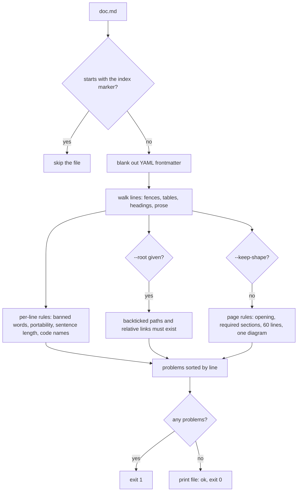

# Doc linter

`lean-docs check` fails a markdown doc that is too long, hard to read, padded with filler, unportable, or names files that don't exist. It needs no AI and no network, so it runs the same in an agent, a pre-commit hook or CI.

## How it works



The rules split in two. Page-shape rules apply to feature pages only, and `--keep-shape` turns them off for runbooks, ADRs and guides. Bloat rules, long sentences and path rules always run. Portability and the code-name limit are for feature pages only. `check` with no files lints every page with a Code table, and every guide with a `lean-docs-code` line as if `--keep-shape` were given. A path in that line that doesn't exist always fails.

## Use it

```bash
npx lean-docs check --root . docs/features/*.md   # feature pages, paths checked
npx lean-docs check --keep-shape README.md         # a guide keeps its own sections
```

## Config
| Setting | Default | What it changes |
|---|---|---|
| `--root <dir>` | off | checks that every backticked path with a `/` and an extension exists under the dir |
| no files | every page | `lean-docs check` alone checks every page with a Code table, with `--root .` on |
| `--keep-shape` | off, on for `overview.md` | skips sections, opening, the 60-line cap, diagram rules, the line-number rule, portability, the code-name limit and path checks in prose |
| `MAX_LINES` | 60 lines | non-blank lines, not counting mermaid blocks or the `Use it` example |
| `MAX_EXAMPLE` | 15 lines | one code block under `Use it` |
| `MAX_WORDS` | 30 words | per sentence, outside tables and the Code section |
| `MAX_CODE_NAMES` | 3 | backticked names in one prose sentence, and 1 in the opening; URLs, URL paths (`/items/`) and status codes (`307`) don't count |

## Does not
- Check paths without `--root`. A typo in a path then passes.
- Check paths without a slash. A bare `config.ts` in backticks is never checked.
- Split sentences on anything but `.`, `!` or `?` followed by a space. "e.g. x" counts as two sentences.
- Apply sentence or code-name limits inside tables or under `## Code`.
- Flag a banned phrase inside quotes or backticks, so a page can name the rule it follows.
- Read the code to check claims. That is the audit mode of the agent skill.
- Lint the generated index: a file starting with the index marker is skipped.

## Breaks when
| Symptom | Likely cause | Check |
|---|---|---|
| `does not exist, the doc is stale or invented` on a MIME type | any backticked word with a slash and a dot counts as a path | reword it, or drop the backticks |
| ``isn't in <file>: renamed?`` for a function | a symbol named in a Code row is no longer in that file, so the page would never go stale for it | rename it in the row, or drop it |
| `section "Overview" is not allowed` | only How it works, Use it, Terms, Config, Does not, Breaks when and Code are allowed | use `--keep-shape` if the doc isn't a feature page |
| `relative link breaks outside the repo` | a `[x](../y.md)` link; a page in the same folder, `[x](y.md)`, is fine | write the path in backticks |
| `link to X points at nothing` | with `--root`, a relative link whose target file is gone | fix the link or the moved file |
| `line numbers drift` | a backticked file name with a colon and a line number | name the function instead |
| `lean-docs: no such file: docs/features/*.md` and exit 2 | the glob matched nothing, so the shell passed it literally | the folder and pattern |
| `is inside ..., already in "## Code"` | a file row under a folder row; `affected` already watches the whole folder | keep the folder row or list the files, not both |
| `table with 1 row, write it as a sentence` | a table with one data row, outside `## Code` | write it as a sentence |

## Code
| Where | What |
|---|---|
| `skills/lean-docs/scripts/lean-docs.mjs` `check`, `BANNED`, `PORTABILITY` | `check()`: limits, banned phrases, portability patterns, required sections; the CLI's default command |
| `examples/after.md` | a page that passes, linted in CI |
