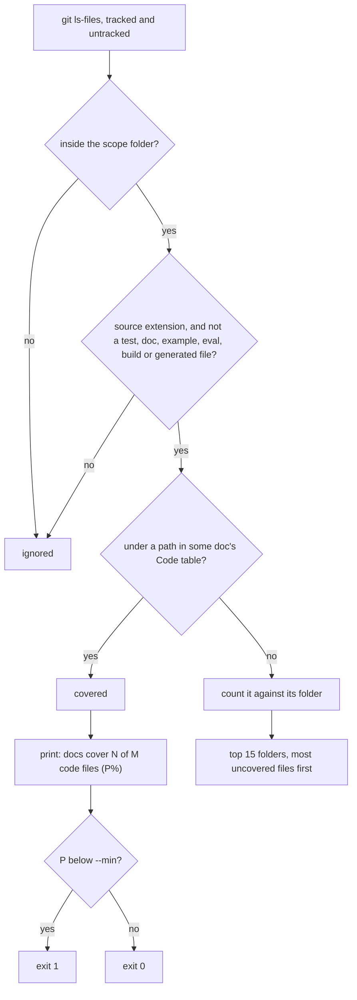

# Docs coverage

`lean-docs coverage` reports what share of the repo's source files some doc's Code table covers, and the folders with the most uncovered files. It tells you where to write the next pages.

## How it works



A guide's `lean-docs-code` line covers files the same way. Only files that a feature page would describe count. A scope with no source files prints `docs cover no code files: none found`, not 100%, and fails any `--min` gate. A folder that doesn't exist exits 2.

## Use it

```bash
npx lean-docs coverage                  # whole repo, biggest gaps first
npx lean-docs coverage packages/api --min 70
```

## Config
| Setting | Default | What it changes |
|---|---|---|
| `[dir]` | whole repo | only files under this folder count, for one package of a monorepo |
| `--min <pct>` | 0 % | exit 1 when coverage rounds below this |

## Does not
- Count tests, docs, examples, evals, fixtures, vendored or compiled code, minified files, build output, migrations, generated code, dot-folders, dotfile configs such as `.eslintrc.js`, or `__name__` folders such as `__mocks__`. .NET test projects such as App.Tests and SwiftPM `Tests/` and `Example/` folders count as tests and examples, and so does a C `test.c` suite. Django's `tests.py` and `test.py` count as tests too. A `bundled/` folder, such as a bundled formatting library, counts as vendored code. Dart-style `example_dart/` and `dio_test/` folders count as examples and tests. Icon components generated into an `svg/` folder count as generated code.
- Count a Docusaurus site in a subfolder: anything next to or under a non-root `docusaurus.config.*`, such as a `www/` folder, is the docs site's own code.
- Count a top-level `scripts/` folder. It is treated as tooling, but a nested one like `skills/x/scripts/` counts.
- Count config, markdown, YAML or shell files. Only the source extensions in `CODE` count.
- Look at what a doc says. A file listed in any Code table counts as covered. When pages name only some of a file's functions, it still counts, and the output says how many files are covered only in part.
- Count pages in example, eval, fixture or test folders. Those are sample docs, so their Code tables cover nothing.
- List more than 15 gap folders. The rest show as one "… and N more folders" line.

## Breaks when
| Symptom | Likely cause | Check |
|---|---|---|
| `docs cover no code files: none found` | the scope folder has no source, or every file matches `NOT_CODE` | the folder argument, and the patterns in `NOT_CODE` |
| `lean-docs: no such folder: <dir>` or `unknown option`, exit 2 | a typo in the folder or a flag | `lean-docs help` |
| A new page doesn't raise coverage | its Code paths don't match the files, or the page has no `## Code` heading | the paths in the page against `git ls-files` |
| `lean-docs: not a git repository. Run it inside one.` | not inside a git repo | run it from the repo |

## Code

- `skills/lean-docs/scripts/lean-docs.mjs` `coverage`, `CODE`, `NOT_CODE`: `coverage()`, the `CODE` and `NOT_CODE` patterns, and the `coverage` command output
