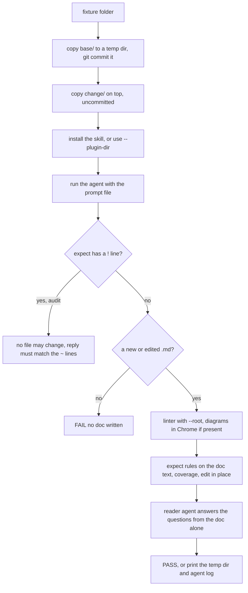

# End-to-end evals

`evals/run.sh` hands small fixture repos to a real agent with the skill installed, then grades the doc it wrote. A second agent that sees only the doc must answer a newcomer's questions, so a short doc that explains nothing fails.

## How it works



The doc graded is the new markdown file. Only when no file is new, as in trim mode, is it the edited one.

## Use it

```bash
evals/run.sh evals/write-rate-limit
AGENT='npx -y @openai/codex exec -s workspace-write -' evals/run.sh
```

## Terms
| Term | Meaning |
|---|---|
| Fixture | a folder with `base/`, an optional `change/`, a `prompt`, an `expect` and optional `questions` |
| `expect` line | `+re` must appear, `-re` must not, `= path` must be the edited doc, `% N` minimum coverage, `!` read-only, `~re` the reply must match, `^ path` a file whose lines the agent may add to but not change |
| `questions` | one question, a tab, and a regex the reader's answer must match; "unknown" never counts |

## Config
| Setting | Default | What it changes |
|---|---|---|
| `AGENT` | `claude -p` with a fixed tool allowlist | any CLI that reads the prompt on stdin, such as Codex |
| `READER` | `claude -p` | the agent that answers questions from the doc |
| `CHROME` | the macOS Chrome or Chromium app, then Chrome or Chromium on `PATH` | where to find Chrome for the diagram parse; skipped if none |
| arguments | every fixture | run only the named fixture folders |

## Does not
- Run in CI. `npm test` covers only the CLI.
- Parse diagrams without Chrome and network. `evals/diagrams.mjs` loads mermaid 11 from jsDelivr.
- Clean up. Each run leaves its temp dir and log.
- Install the skill when `AGENT` contains `--plugin-dir`; the plugin brings it.

## Breaks when
| Symptom | Likely cause | Check |
|---|---|---|
| `FAIL no doc written` | the agent stopped early or wrote outside markdown | the agent log next to the temp dir |
| `FAIL reader  <question> -> 3: unknown` | the doc lacks the fact, or hides it in a code name | the doc against `questions` |
| `FAIL coverage 40%, min 80%` | pages missing, or Code tables with wrong paths | `lean-docs coverage` in the temp dir |
| `FAIL diagrams` | real mermaid rejects a diagram the linter passed | the line printed by `evals/diagrams.mjs` |
| `FAIL changed files:` on an audit fixture | the agent edited files in read-only mode | the listed files |

## Code
| Where | What |
|---|---|
| `evals/run.sh` | fixture setup, the agent command, every grading rule |
| `evals/diagrams.mjs` | parses mermaid blocks with real mermaid in headless Chrome |
| `evals/write-rate-limit/` | fixture: document a new rate limiter |
| `evals/update-rate-limit/` | fixture: edit the existing page after a change |
| `evals/trim-invoice-export/` | fixture: trim a bloated doc and drop a planted false claim |
| `evals/audit-planted/` | fixture: read-only audit of a doc with planted errors |
| `evals/bootstrap-small/` | fixture: document a small repo, coverage at least 80 % |
