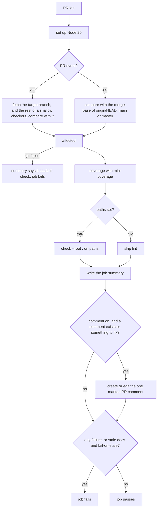

# GitHub Action

The repo is also a composite GitHub Action that, on each PR, lists the pages the change updated and the docs it made stale, reports coverage, and lints feature docs. It writes the report to the job summary, posts it as one PR comment when there's something to fix, and fails the job on any problem you opted into.

## How it works



A failed comparison never reads as "no stale docs". If git can't compare, the summary says so and the job fails.

## Use it

```yaml
permissions: { contents: read, pull-requests: write }   # job level, for the comment
steps:
- uses: actions/checkout@v4
  with: { fetch-depth: 0 }   # the diff needs the base branch
- uses: seifguerbouj/lean-docs@v0
  with: { paths: docs/features/*.md, min-coverage: 50 }
```

## Config
| Setting | Default | What it changes |
|---|---|---|
| `paths` | `docs/features/*.md` | docs to lint, expanded by the shell; empty skips linting |
| `args` | empty | extra lint flags, such as `--keep-shape` |
| `fail-on-stale` | `true` | fail when changed code has a doc that wasn't updated |
| `min-coverage` | `0` % | fail below this coverage; 0 never fails |
| `comment` | `true` | one PR comment, created when there's something to fix and edited on later pushes |

## Does not
- Comment on a clean PR that never had a problem, or post a second comment. It edits the one with the `<!-- lean-docs -->` marker.
- Miss a `lean-docs-ok` line on a shallow checkout (`fetch-depth: 1`). It fetches the full history first.
- Fail the job when it can't comment (fork PRs, a read-only token). It prints a notice.
- Fail on stale docs when `fail-on-stale` is anything but the exact string `true`.
- Show every gap. The summary shows the top 5 coverage gap folders.
- Pass on a lint problem, a coverage miss or a git failure, whatever `fail-on-stale` says.

## Breaks when
| Symptom | Likely cause | Check |
|---|---|---|
| `Couldn't check for stale docs:` in the summary | git couldn't diff against the target branch | the git error after it, and `fetch-depth: 0` on checkout |
| `lean-docs couldn't comment on the PR` notice | the token can't write to pull requests, as on fork PRs | `permissions: pull-requests: write`, or `comment: false` |
| `Docs this change made stale.` on a pure refactor | the doc's covered code changed | add `lean-docs-ok: <doc>` to a commit message |
| Job fails with no stale docs and no lint problems | coverage is under `min-coverage` | the Coverage line in the summary ends with `below the N% minimum` |

## Code
| Where | What |
|---|---|
| `action.yml` | inputs, the base ref, which checks fail the job, the report text and the PR comment |
| `evals/action.sh` | runs the action's script on ten local PR scenarios, with a stub `gh` |
| `.github/workflows/test.yml` | this repo's CI: runs the tests, then the action on `docs/features/` |
