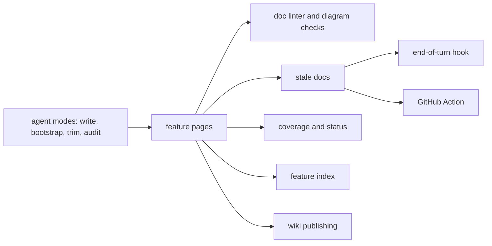

# lean-docs

lean-docs keeps a repo's feature docs short, true and current. A coding agent writes and checks the pages, and a small script without AI finds the pages each change made stale. The same pages become a wiki for people who don't read the code.

## How it fits together

The [agent modes](agent-modes.md) write the pages, and the [linter](doc-linter.md) keeps them in shape. [Stale docs](stale-docs.md) ties each page to its code, so the [hook](stop-hook.md) and the [GitHub Action](github-action.md) can ask for updates. [Wiki publishing](wiki-publish.md) shows the same pages to everyone else.

## Areas

- **Writing pages**: [Agent modes](agent-modes.md), [Doc linter](doc-linter.md), [Diagram checks](diagram-checks.md)
- **Keeping them true**: [Stale docs](stale-docs.md), [End-of-turn hook](stop-hook.md), [GitHub Action](github-action.md)
- **Seeing the state**: [Status](status.md), [Docs coverage](docs-coverage.md), [Feature index](feature-index.md)
- **Sharing**: [Wiki publishing](wiki-publish.md)
- **Testing**: [Evals](evals.md)
