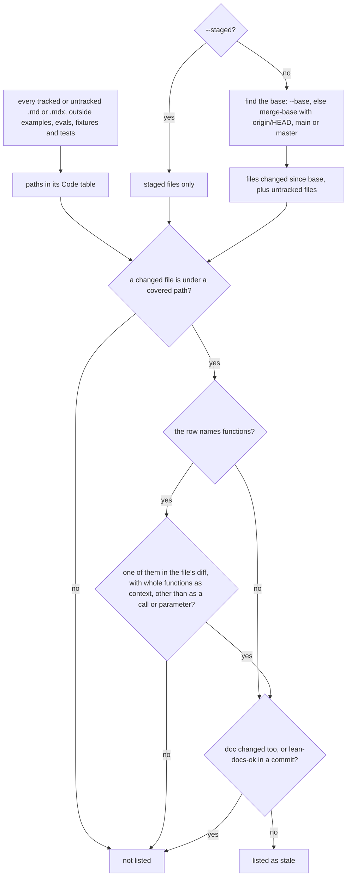

# Stale docs

`lean-docs affected` lists the docs whose covered code changed on this branch while the doc itself did not. It reads only git and the Code table of each doc, so it costs no tokens.

## How it works



A path in the Code table covers itself and everything under it as a folder. A renamed or deleted file counts under its old name, and the report says where it went. A doc with no paths in `## Code` is never stale, so the Code table is what makes a page trackable. A guide that keeps its own shape gets the same rows from one invisible line, `[//]: # (lean-docs-code: httpx/_config.py Timeout, httpx/_client.py)`, anywhere outside a code fence. When several pages share one big file, a row can name functions after the path. Then only a change to those functions makes the page stale, and the report names the ones that changed (`src/middleware/csrf/index.ts: isSafeMethodRe`).

Likely pages come first. A page whose text shares no camelCase or snake_case name, string or 2+ digit number with the changed lines, and whose changed lines don't mention deprecation, ends in `(check: no changed name or string is in the doc)`. It is still stale and still fails `--strict`.

## Use it

```bash
npx lean-docs affected                      # docs this branch made stale
npx lean-docs affected --staged --strict    # before a commit, exit 1 if any
git commit -m "Rename send" -m "lean-docs-ok: docs/features/send.md"   # still right
```

## Terms
| Term | Meaning |
|---|---|
| Covered path | a backticked path in the Where cell of `## Code` with a `/` or a file extension; a `:line` suffix is dropped |
| `lean-docs-code` line | a hidden line naming the code a guide describes: comma-separated items, each a path and its symbols, backticks optional |
| Symbol | any other backticked word in the same Where cell, such as `send`, `send()`, `Client.send` or `Worker::send`; it matches by the last part, `send`. When the Where cell names symbols, names in the What cell count too, but only as the changed function itself |
| `lean-docs-ok` | a commit message line, `lean-docs-ok: docs/features/x.md` or `lean-docs-ok: all`, saying the doc is still right |

## Config
| Setting | Default | What it changes |
|---|---|---|
| `--base <ref>` | merge-base with `origin/HEAD`, `main` or `master` | the ref to diff against, used as given, not its merge-base |
| `--staged` | off | diff only staged files; trailers come only from `--message` |
| `--message <file>` | none | read `lean-docs-ok` from the commit message being written, for a git `commit-msg` hook |
| `--strict` | off | exit 1 when any doc is stale; otherwise always exit 0 |

## Does not
- Read a `## Code` heading inside a code fence, such as a page template. Only the page's own section counts.
- Read the doc's text to judge if it's still right. It only ranks pages by shared names. Any edit to the doc clears it.
- Find docs without a Code table or a `lean-docs-code` line, or code mentioned only in the doc's prose.
- Read paths from the What column, or count a mere mention of a What name. A What name counts only when the Where cell names symbols too. Then it counts on the changed function's first line (past its doc comment) or after a definition keyword, so an example value such as `a.b` doesn't flag the page.
- Parse code to match a symbol. It searches the changed function for the whole word, so a comment that mentions `send` counts as a change to `send` when the same hunk also changes code. A call such as `send(` or `x.send` doesn't count, unless it's on the changed function's first line (past its doc comment and annotations such as `@override`). Nor does a parameter or a labelled argument with that name, such as `(_ send: Msg)` or `for: send`, even on the first line. A property declared in a constructor, such as `(val send: Int)` or `(private send: T)`, still counts. git's own finders delimit functions in Python, Go, Rust, Java, Kotlin, Ruby, PHP, C, C++, C#, Objective-C, Perl and Elixir. A lean-docs pattern does it in JavaScript, TypeScript, Swift and Dart. In other languages a method's change counts for its whole class. A change outside any function, such as a top-level constant, counts from its own statement, not from the function above it. In a script that keeps every command in one block, such as `if __name__ == '__main__':`, a change counts only from the command's own statement, such as `if (command === 'coverage') {...}`.
- Trust git's function finder in Python. git also takes a `def` inside a docstring's example code as a function. So lean-docs finds the enclosing `def` or `class` itself, skipping strings and brackets. A multi-line signature counts as part of its function, and each block ends at the next statement indented no deeper. On FastAPI's source it credits every code line to the same function or class as Python's own parser.
- Count a change to a code file that only re-indents, re-wraps or edits comments, unless a changed line mentions deprecation (`@deprecated`). In Python a changed indent still counts. A statement moved past an unchanged line counts, since the hunk's code is compared before and after with its context lines.
- Look at trailers outside base..HEAD. A trailer on a commit already on main doesn't count.
- Report a page you're still editing. A page changed in the same diff as its code counts as updated, even before you commit it. Commit the page with the code, or check it after.
- Fail without `--strict`. It prints the list and exits 0.
- Leave out who to ask. If `overview.md` gives the page's area an owner, the line names them: `docs/features/x.md (owner: Jana): ...`.
- Stay silent when nothing is stale. It prints one line with the number of changed files and the base it compared against.

## Breaks when
| Symptom | Likely cause | Check |
|---|---|---|
| Nothing listed on `main` itself | the merge-base with main is HEAD, so only uncommitted and untracked changes count | pass `--base <ref>` |
| `lean-docs: git diff --name-status -M origin/x failed. Check the --base ref.` | the base ref isn't fetched | `git fetch origin x` |
| `lean-docs: not a git repository. Run it inside one.` | run outside a git repo | `git rev-parse --show-toplevel` |
| `no stale docs (... since the empty tree, no commits yet ...)` | the repo has no commits, so every file counts as new and a page added with its code is never stale, even with `--strict` | `git log` |
| A doc listed though its code is untouched by you | an untracked file under a covered folder counts as changed | `git status` |
| A page with symbols listed though its functions didn't change | the symbol is a common word (`index`, `check`) found elsewhere in the changed functions, not as a call, or the file is new or untracked, so all of it counts | `git diff --function-context <base> -- <file>` |
| A page never listed though its function changed | the symbol is misspelled or was renamed, so it never matches | the Where cell against the code |
| `lean-docs-ok` ignored | With `--staged`, no `--message` was passed. Or the trailer is on a commit outside base..HEAD | The hook command, or `git log <base>..HEAD` |

## Code

- `skills/lean-docs/scripts/lean-docs.mjs` `affected`, `codeRows`, `codePaths`, `reviewedIn`, `changedFiles`, `differ`, `branchBase`, `shares`: `codeRows()` reads paths and symbols, `differ()` gets each file's diff, `affected()` matches them, `shares()` ranks them; `reviewedIn()`, `changedFiles()`, `branchBase()` and the `affected` command
