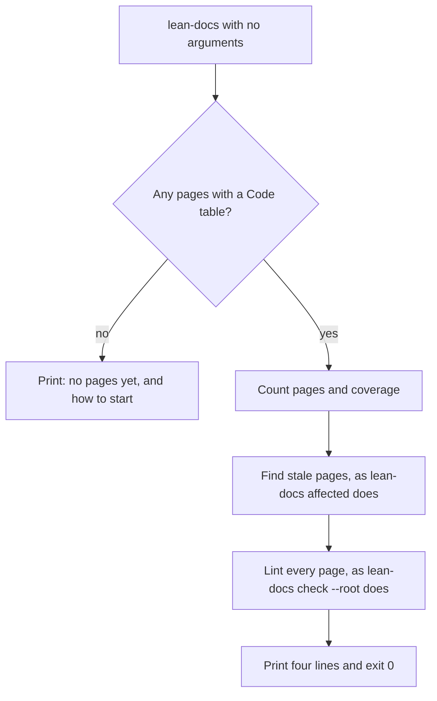

# Status command

Running `lean-docs` with no arguments prints the state of a repo's docs in four lines. It shows the page count, how much code they cover, which pages are stale and which fail the lint.

## How it works



Guides tied to code by a `lean-docs-code` line are counted after the pages, checked as guides, and can be stale too. A fifth line appears when several pages list the same file without naming functions, since any change to that file flags all of them. Another appears when a generated index no longer matches its folder. A `wiki:` line appears when the repo has a publish record and some published wiki pages are behind the docs. With `--oneline` it prints one short line, such as "docs 41% · 2 stale", for a status line or a shell prompt. It always exits 0, so it's safe in a prompt or a script. Use `affected --strict`, `coverage --min` or `check` when you want a failing exit code.

## Use it

```bash
npx lean-docs              # pages, coverage, stale docs, lint, gaps
npx lean-docs --oneline    # docs 41% · 2 stale · 1 lint
```

## Does not
- Fail. Stale pages and lint problems are printed, not turned into an exit code.
- Count the generated index, or pages in example, eval, fixture or test folders.
- Show the lint problems themselves. Run `lean-docs check <file>` on the pages it names.

## Breaks when
| Symptom | Likely cause | Check |
|---|---|---|
| `lean-docs: not a git repository. Run it inside one.` | Not inside a git repo | Run it from the repo |
| "no pages yet" though docs exist | The docs have no `## Code` table or `lean-docs-code` line, so nothing ties them to code | Add the line to guides, or bootstrap |
| `lean-docs: unknown command 'afected'` and exit 1 | A mistyped command; a word that isn't a file isn't treated as a page | `lean-docs help` |
| `lean-docs: unknown option --bse` and exit 2 | Every command rejects a flag it doesn't take, so a typo can't pass CI with defaults | `lean-docs help` |
| A page is listed as stale right after you edited the code it covers | That's the point: update the page, or add `lean-docs-ok: <page>` to the commit | `lean-docs affected` |

## Code
- `skills/lean-docs/scripts/lean-docs.mjs` `status`, `USAGE`, `sharedWithoutSymbols`: the status summary, the `noisy:` line and `--help`.
