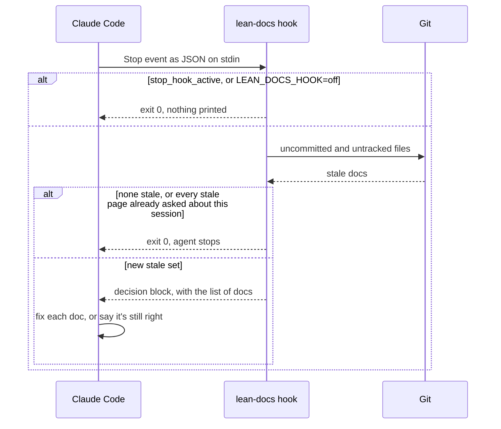

# End-of-turn hook

In Claude Code, the plugin runs a Stop hook that asks the agent once to update the docs its change made stale before it finishes. It's the safety net for an agent that edited code a page describes and forgot the page.

## How it works



It uses the same check as the Stale docs page, but only on uncommitted and untracked files: what the agent just changed. Commits already on the branch are left to CI, so an agent that only answered a question is never stopped. It remembers which pages it asked about in one temp file per working folder, keyed by session id.

Likely pages come first. A page marked `check` shares no name or string with the change, so the agent reads only its lines about the changed function.

## Use it

```bash
LEAN_DOCS_HOOK=off claude   # one session without the reminder
```

## Config
| Setting | Default | What it changes |
|---|---|---|
| `LEAN_DOCS_HOOK=off` | on | the hook exits at once and never blocks |
| `timeout` in `hooks/hooks.json` | 10 s | Claude Code kills the hook after this |

## Does not
- Block twice in a row: it never runs while the agent continues from its own block.
- Check that the agent's fix is right. Any edit to the doc clears it.
- Leave out who owns the page. When `overview.md` names an owner for its area, the message names them.
- Report errors. Outside a git repo, or on any failure, it exits 0 silently.
- Run outside the Claude Code plugin. A skill installed with `npx skills add` has no hook.

## Breaks when
| Symptom | Likely cause | Check |
|---|---|---|
| The hook never fires after the agent commits | it only reads uncommitted work; committed changes are checked by `lean-docs affected` in CI | `lean-docs affected` |
| It asks again about the same page | a new session | the temp file `lean-docs-hook-<hash>` in the OS temp folder |
| `lean-docs: these docs describe code you changed, but weren't updated` after a change that didn't make the page wrong | the hook can't tell a refactor from a behaviour change | say the page is still right; the hook won't ask again this session |
| Nothing happens at all | not installed as a plugin, `LEAN_DOCS_HOOK=off`, or Node missing | `/plugin` list, and `node --version` |

## Code
| Where | What |
|---|---|
| `hooks/hooks.json` | registers the Stop hook and its timeout |
| `skills/lean-docs/scripts/lean-docs.mjs` `hook` | the `hook` command: the off switch, the once-per-set memory, the message to the agent |
