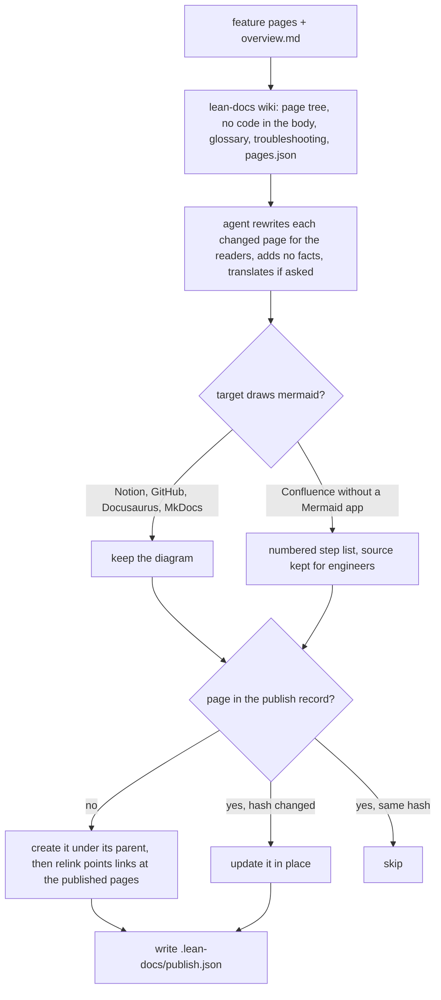

# Wiki publishing

Publishing turns the feature pages into a wiki for people who don't read the code, such as product, support, ops and new joiners. It lands in Confluence, Notion or a docs site, generated from the repo, so publishing again brings it up to date.

## How it works



The script part needs no AI, so anyone can preview the reader view with `lean-docs wiki`. Only the rewrite costs tokens, and only for pages whose hash changed since the last publish. The page ids live in `publish.json` in the `.lean-docs` folder, which the team commits so everyone updates the same pages. Each page starts with a link to its source page on the forge (GitHub, GitLab or Bitbucket, at the default branch) and, if the overview names one, the area's owner.

## Use it

```bash
npx lean-docs wiki docs/features            # preview in .lean-docs/wiki/, no AI, no connector
npx lean-docs                               # says when published pages are behind the docs
/lean-docs:publish Confluence space DOCS under "Engineering"
```

## Terms
| Term | Meaning |
|---|---|
| Reader view | The generated pages: overview, areas, features, glossary, troubleshooting |
| Publish record | `publish.json` in `.lean-docs`: target, readers, diagram choice, and each page's id and hash |

## Does not
- Upload images. Confluence's connector has no upload tool, so without a Mermaid app diagrams become step lists.
- Delete published pages. A page that's no longer generated gets reported, not removed.
- Let wiki edits flow back. Every page says it's generated, and the next publish overwrites it.
- Publish without asking. The target is confirmed before the first publish.
- Find the published pages again without the record. If the record is lost or ignored by git, the next publish creates a second tree.

## Breaks when
| Symptom | Likely cause | Check |
|---|---|---|
| A second copy of every page appears | The record wasn't committed, often because `.gitignore` ignores `*.json` | `git check-ignore -v` on the record |
| `lean-docs: no feature pages in docs/features` | The folder has no pages with a `Breaks when` section | the folder argument |
| Pages hang directly under the overview, with no areas | `overview.md` is missing or has no `## Areas` list | `docs/features/overview.md` |
| Diagram shows as raw code in Confluence | It was published as mermaid to a space without a Mermaid app | the `diagrams` value in the record |

## Code
| Where | What |
|---|---|
| `skills/lean-docs/scripts/lean-docs.mjs` `wiki`, `splitPage`, `tableRows`, `areaLine`, `obsidian`, `notion`, `relink` | builds the reader view and `pages.json`, the Obsidian and Notion formats, and the second-pass links |
| `skills/lean-docs/reference/publish.md` | connector setup, the rewrite rules, diagrams, publishing and the record |
| `commands/publish.md` | the `/lean-docs:publish` command |
