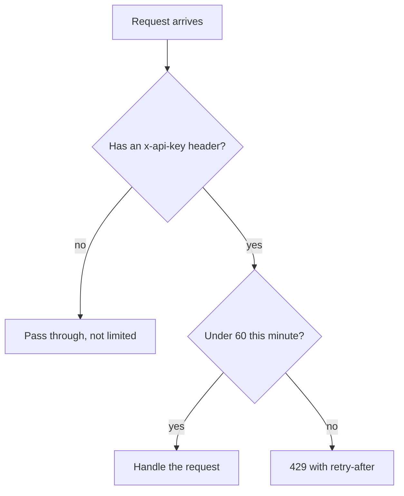

# Rate limit

Each API key can make 60 requests per minute. Over the limit, the server answers `429` and tells the client how long to wait.

## How it works

The window is fixed: it starts at a key's first request and resets 60 s later.

## Config

| Setting | Default | What it changes |
|---|---|---|
| `RATE_LIMIT_PER_MIN` | 60 requests | Requests allowed per key per minute |
| Window | 60 s, fixed | Not configurable |

## Does not

- Limit requests without an `x-api-key` header.
- Share counts across instances. Each process counts on its own, so 3 instances allow 3 times the limit.
- Survive a restart. Counters live in memory.

## Breaks when

| Symptom | Likely cause | Check |
|---|---|---|
| Every keyed request gets `429` | `RATE_LIMIT_PER_MIN` is not a number | The env var |
| Clients get past the limit | Several instances, or clients drop the key header | Instance count, request headers |

## Code

| Where | What |
|---|---|
| `src/rateLimit.js` | Counting, the 429 response |
| `src/server.js` | Calls the limiter first |
