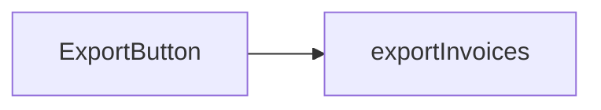
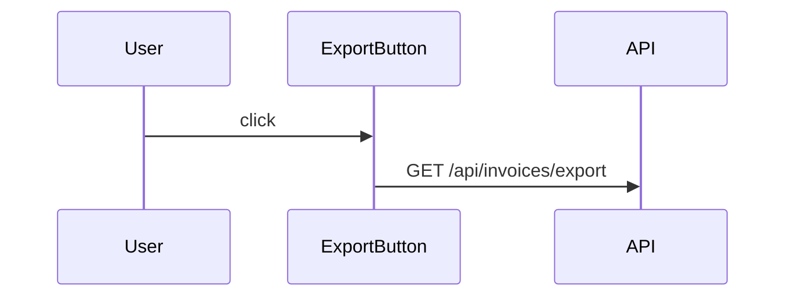

# Invoice CSV Export Feature Documentation

## Table of Contents

1. Introduction
2. Overview
3. Architecture
4. Components
5. Data Flow
6. Configuration
7. Error Handling
8. Testing
9. Future Work
10. Conclusion

## Introduction

This document describes the Invoice CSV Export feature, a powerful and robust new capability that enables users to seamlessly export their invoice data to CSV format. This feature was developed to address the growing need for users to work with their invoice data in external tools such as Excel, Google Sheets, and other spreadsheet applications.

It is important to note that this feature leverages our existing invoice infrastructure to provide a comprehensive and intuitive export experience.

## Overview

The Invoice CSV Export feature provides users with the ability to export invoices. A copy of every export is also emailed to the account owner. When a user clicks the "Export CSV" button on the invoices page, the system will generate a CSV file containing the invoices that match the current filters and download it to the user's computer.

### Key Benefits

- **Efficiency**: Users can easily export data without manual copying.
- **Flexibility**: Works with any spreadsheet application.
- **Scalability**: Built on a scalable architecture.
- **User Experience**: Intuitive one-click export.

## Architecture

The feature follows a clean, layered architecture that leverages our existing patterns.

### Components

| Component | Location | Description |
|-----------|----------|-------------|
| ExportButton | `src/invoices/ExportButton.tsx` | The button component that triggers the export |

### Backend

The backend is implemented in `src/api/invoices/export.ts`. The `exportInvoices` function accepts a `filters` parameter of type `InvoiceFilters`. It calls `db.invoices.findMany(filters)` to retrieve the invoices, then maps each invoice to a row using the `toCsvRow` helper function, then joins the rows with newline characters, and finally returns the result with a `text/csv` content type header.

The `toCsvRow` function takes an `Invoice` object and returns a string. It extracts the `id`, `customer`, `amount`, `currency`, `status`, and `issuedAt` fields and joins them with commas, escaping any values that contain commas or quotes.

## Data Flow

The data flows from the user to the button to the API. The API then queries the database and returns the CSV file.

## Configuration

| Setting | Default |
|---------|---------|
| EXPORT_MAX_ROWS | 10000 |

Note that if the number of matching invoices exceeds `EXPORT_MAX_ROWS`, the export is rejected with a 413 status and the button shows "Too many invoices, narrow your filters". Also, please note that all dates are exported in UTC regardless of the user's timezone.

## Error Handling

The feature includes comprehensive error handling. If an error occurs during export, the error is caught and an appropriate error message is displayed to the user. Errors are logged using our standard logging infrastructure.

## Testing

The feature has been thoroughly tested with unit tests and integration tests. Tests can be found in `src/api/invoices/export.test.ts`.

## Future Work

- Add support for Excel (.xlsx) format.
- Add support for PDF export.
- Allow users to select which columns to export.
- Add scheduled exports via email.
- Support exporting more than 10,000 rows via background jobs.

## Conclusion

In summary, the Invoice CSV Export feature provides a seamless, robust, and user-friendly way for users to export their invoice data. By leveraging our existing infrastructure, we have delivered a scalable solution that meets the needs of our users while laying the groundwork for future enhancements.
