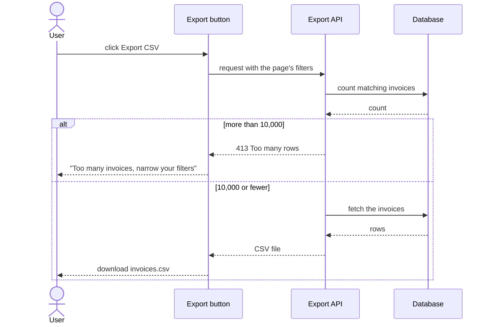

# Invoice CSV export

Finance users click **Export CSV** on the invoices page and get a spreadsheet of every invoice that matches their current filters. Large exports are refused rather than cut short, so a file never silently misses rows.

## How it works

The API counts before it fetches, so a huge export costs one cheap query, not a full read.

## Config

| Setting | Default | What it changes |
|---|---|---|
| `EXPORT_MAX_ROWS` | 10,000 rows | The cap. Above it, the export is refused with a 413. |
| Timezone | UTC, fixed | Not configurable. Every date in the file is UTC. |

## Does not

- Convert dates to the user's timezone.
- Export in the background or by email. Above the cap, the user must narrow the filters.
- Let users pick columns. The file always has: id, customer, amount, currency, status, issued date.

## Breaks when

| Symptom | Likely cause | Check |
|---|---|---|
| "Too many invoices, narrow your filters" | More than `EXPORT_MAX_ROWS` invoices match | Expected. Raise the cap only if the database can take it. |
| The file is empty, but the page shows invoices | The button and the API disagree on filter names | Compare the filters the button sends with what the API reads |
| A customer name is split across two columns | A comma or quote in the name was not escaped | The CSV row builder and its test |

## Code

| Where | What |
|---|---|
| `src/invoices/ExportButton.tsx` | The button, the 413 message, the download |
| `src/api/invoices/export.ts` | Count, cap, fetch, CSV rows (`toCsvRow`) |
| `src/api/invoices/export.test.ts` | Escaping tests |
