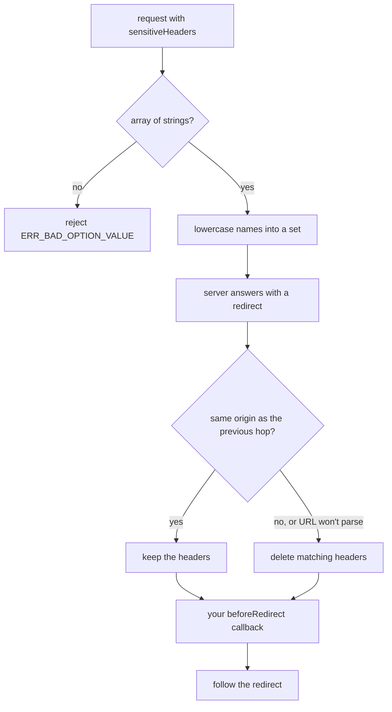

# Strip custom secret headers on cross-origin redirects

In Node.js, axios deletes the request headers you name in `sensitiveHeaders` before following a redirect to another origin. Use it for custom secrets like an API key header, which the redirect library does not strip on its own.

## How it works



Origin means scheme, host and port, so an HTTPS-to-HTTP hop or a port change on the same host also strips. If either URL fails to parse, axios treats the hop as cross-origin and strips. Your own `beforeRedirect` runs after the strip, so it can add a header back.

## Use it

```js
axios.get('https://api.example.com/users', {
  headers: { 'X-API-Key': 'secret' },
  sensitiveHeaders: ['X-API-Key'],
});
```

Set it on an instance with `axios.create({ sensitiveHeaders: [...] })` to cover every request.

## Config
| Setting | Default | What it changes |
|---|---|---|
| `sensitiveHeaders` | unset (nothing extra stripped) | Header names to delete on cross-origin redirects, matched case-insensitively. |
| `maxRedirects` | `21` hops (the `follow-redirects` default) | At `0` axios follows no redirects, so `sensitiveHeaders` is never used. |

## Does not
- Work in browsers. The XHR and fetch adapters ignore it; the browser applies its own redirect rules.
- Run with a custom `transport` or with `maxRedirects: 0`. Neither path uses `follow-redirects`.
- Merge lists. A request-level `sensitiveHeaders` replaces the instance's list, so repeat the instance's names.
- Read the option from `Object.prototype`. Only an own property on the config counts.
- Change how the standard login and cookie headers are handled. The redirect library already strips those across hosts.

## Breaks when
| Symptom | Likely cause | Check |
|---|---|---|
| `sensitiveHeaders must be an array of strings` | A string or a non-string item was passed, for example `sensitiveHeaders: 'X-API-Key'` | Wrap it in an array. |
| Secret still reaches the redirect target | Header not listed, request-level list dropped an instance name, or a `beforeRedirect` re-added it | The merged config's `sensitiveHeaders` and your `beforeRedirect`. |
| Header missing after a same-host redirect | The hop changed scheme or port, which is a different origin | The `Location` header of the redirect response. |

## Code
| Where | What |
|---|---|
| `lib/adapters/http.js` `dispatchBeforeRedirect`, `stripMatchingHeaders`, `isSameOriginRedirect` | Validation, origin check and header removal |
| `index.d.ts` | `sensitiveHeaders` type on `AxiosRequestConfig` |
| `index.d.cts` | Same type for CommonJS |
| `THREATMODEL.md` | Credential-leak-on-redirect threat and its mitigations |
