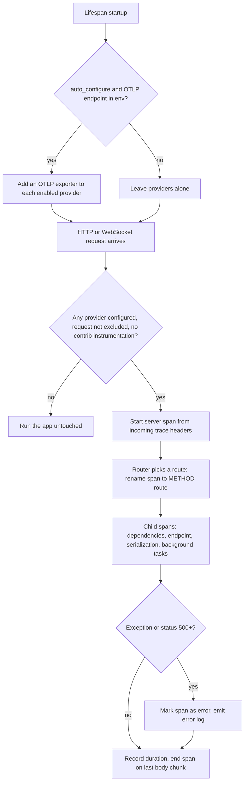

# Built-in OpenTelemetry

FastAPI records a trace span, HTTP metrics and error logs for every request and WebSocket connection, without contrib instrumentation. It stays dormant until some OpenTelemetry provider is configured, and it can wire OTLP export from the standard `OTEL_*` environment variables on its own.

## How it works



The span ends when the last response byte is sent, so background tasks run after it ends. Their spans still join the same trace. A provider counts as configured unless it is one of the API's built-in proxy placeholders, so an app with no OpenTelemetry setup pays almost nothing.

## Use it

```python
from fastapi import FastAPI

app = FastAPI(telemetry={"operation_spans": False})


@app.get("/items/{item_id}")
async def read_item(item_id: int):
    return {"item_id": item_id}
```

Export with `OTEL_SERVICE_NAME=my-api OTEL_EXPORTER_OTLP_ENDPOINT=https://collector.example.com fastapi run`.

## Terms
| Term | Meaning |
|---|---|
| Provider | The OpenTelemetry object that creates tracers, meters or loggers and owns their exporters. One per signal, global by default. |
| Operation span | A child span named `fastapi.dependencies`, `fastapi.endpoint`, `fastapi.serialization` or `fastapi.background_task`. |
| Legacy instrumentation | `opentelemetry-instrumentation-fastapi`, the contrib package. Found by walking the built middleware stack. |

## Config
| Setting | Default | What it changes |
|---|---|---|
| `tracing` | `True` | Server spans for requests and WebSocket connections |
| `metrics` | `True` | `http.server.request.duration` (s) and `http.server.active_requests`, HTTP only |
| `logs` | `True` | Validation-failure warnings and unhandled-exception error logs |
| `operation_spans` | `True` | The child spans listed in Terms |
| `auto_configure` | `True` | Adds OTLP exporters from env at lifespan startup |
| `exclude` | `None` | Function of the ASGI scope; `True` skips telemetry for that request |
| `tracer_provider`, `meter_provider`, `logger_provider` | `None` (global) | Use this provider instead of the global one |

Set once per app: `FastAPI(telemetry={...})`. Auto-configure reads the standard OTLP endpoint, exporter and protocol variables, per signal or shared, and skips everything when `OTEL_SDK_DISABLED=true`.

## Does not
- Export anything unless a lifespan startup runs. Auto-configure hooks `lifespan.startup`, so a `TestClient` used without `with`, or a server running with lifespan off, adds no exporters.
- Double-record next to contrib instrumentation. When the legacy middleware is in the stack, native spans, metrics and logs all switch off for that app.
- Put request bodies or parsed values on spans or logs. `get_telemetry_data()` exposes them to synchronous log or span processors only, and returns `None` once the request finishes.
- Record WebSocket metrics, or log disconnects with codes `1000` and `1001`.
- Give mounted sub-apps their own providers. Providers are process-global, and an outer app's span covers the mounted app's request.
- Shut down providers you pass in. It flushes the exporters it added at lifespan shutdown and shuts them down at process exit.
- Mark 4xx responses, `HTTPException` or validation errors as span errors.

## Breaks when
| Symptom | Likely cause | Check |
|---|---|---|
| Startup fails: `FastAPI automatic telemetry supports OTEL_TRACES_EXPORTER=otlp or none.` | Env asks for another exporter, such as `console` | Unset it, or configure it yourself with `auto_configure: False` |
| Startup fails: `FastAPI automatic telemetry requires the OTLP http/protobuf protocol.` | `OTEL_EXPORTER_OTLP_PROTOCOL=grpc` | Use `http/protobuf`, or pass your own exporter |
| Startup fails: `Automatic OpenTelemetry export requires fastapi[opentelemetry] or fastapi[standard].` | Endpoint set but SDK and exporter not installed | Install the extra |
| Startup fails: `does not support adding an OTLP exporter` | A vendor provider without `add_span_processor` and friends | Let the vendor handle env export, `auto_configure: False` |
| Every span arrives twice | A vendor library and FastAPI both export to the env endpoint | Turn off one of them |
| Span named `GET` with no route | No route matched, for example a 404 | Expected; `http.route` is set only after routing |
| Error span with `error.type` `incomplete_response` or `ConnectionError` | App returned without finishing the body, or client disconnected | Streaming endpoints and proxies in front |

## Code
| Where | What |
|---|---|
| `fastapi/telemetry/_api.py` | Config keys and defaults docs, `TelemetryData`, operation spans, validation logs, route naming |
| `fastapi/telemetry/_asgi.py` | Server span, metrics, exception logs, trace-header extraction, query redaction, legacy detection |
| `fastapi/telemetry/_runtime.py` | OTLP setup from env at lifespan startup, flush and shutdown of owned exporters |
| `fastapi/applications.py` `FastAPI.__call__` | The `telemetry` argument, its defaults and the entry point per request |
| `fastapi/routing.py` | Operation-span and route-naming hooks in the request handler and routers |
| `fastapi/background.py` `BackgroundTasks.__call__` | One span per background task |
| `pyproject.toml` | `opentelemetry-api` dependency and the `opentelemetry` extra |
| `docs_src/opentelemetry` | Examples used by the user guide `docs/en/docs/advanced/opentelemetry.md` |
