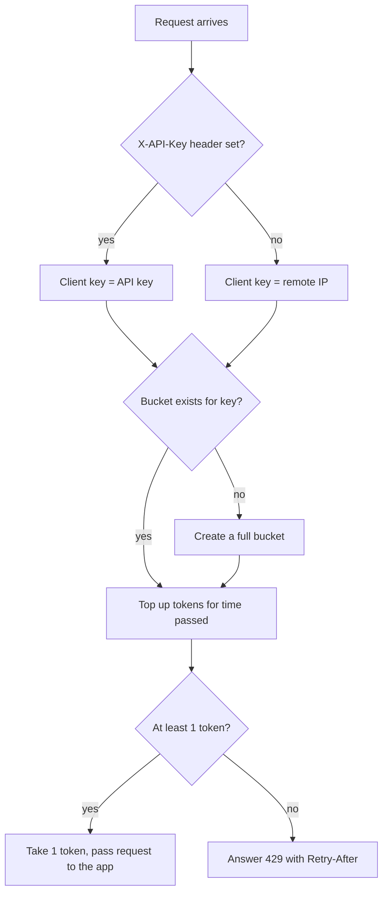

> Example page, written by lean-docs for a small demo repo (`gatekeeper`, a token-bucket rate limiter). Unedited apart from this line.

# Per-client rate limiting

Gatekeeper caps how many requests each client makes to a Python WSGI app. Each client gets its own token bucket, so short bursts pass and steady overuse gets `429 Too Many Requests`.

## How it works



A new bucket starts full, so a fresh client can send `capacity` requests at once. After that it gets one request per `1 / refill_per_second` seconds. Buckets live in a plain dict in one process, so each worker process counts separately.

## Use it

```python
from wsgiref.simple_server import make_server
from gatekeeper import Config, RateLimiter
from gatekeeper.middleware import RateLimitMiddleware

def app(environ, start_response):
    start_response("200 OK", [("Content-Type", "text/plain")])
    return [b"hello"]

# 20-request burst, then 5 requests per second per client
limited = RateLimitMiddleware(app, RateLimiter(Config(capacity=20, refill_per_second=5)))
make_server("", 8000, limited).serve_forever()
```

Leave out the `RateLimiter` argument and the settings come from the environment variables below. Outside WSGI, call `RateLimiter.allow(key, cost)` yourself; it returns `(allowed, retry_after_seconds)`.

## Terms
| Term | Meaning |
|---|---|
| Token bucket | A counter that holds up to `capacity` tokens and refills at a steady rate. Each request spends one token. |
| Client key | The string a bucket belongs to: the `X-API-Key` header, else the remote address, else `unknown`. |

## Config
| Setting | Default | What it changes |
|---|---|---|
| `GATEKEEPER_CAPACITY` | `10` tokens | Largest burst a client can send at once. |
| `GATEKEEPER_REFILL` | `1.0` tokens per second | Sustained request rate per client. |
| `GATEKEEPER_PENALTY` | `0.0` s | Nothing yet: it is read into `Config.burst_penalty_seconds` but no code uses it. |

The environment is read once, when a `RateLimiter` is built without a `Config`. Passing a `Config` ignores the environment entirely.

## Does not
- Share limits across processes or hosts. Four workers mean four times the limit.
- Lock its buckets. Concurrent threads can race on the same bucket and let an extra request through.
- Forget clients on its own. Buckets stay in memory until something calls `RateLimiter.forget(key)`; the middleware never does.
- Check the API key. Any `X-API-Key` value gets a fresh, full bucket, so a client can dodge the limit by changing it.
- See the real client behind a proxy. Without an API key, every client behind the proxy shares the proxy's address and one bucket.
- Charge more than 1 token per request in the middleware. Costs other than 1 only work through `RateLimiter.allow`.

## Breaks when
| Symptom | Likely cause | Check |
|---|---|---|
| `429 Too Many Requests` with body `Too many requests` for many users at once | They share a client key: same proxy address, or no address so all fall back to `unknown` | `REMOTE_ADDR` as the app sees it; whether clients send `X-API-Key` |
| `OverflowError` in the middleware on the first request over the limit | `GATEKEEPER_REFILL=0`, so the wait time is infinite and the `Retry-After` header can't round it to whole seconds. `RateLimiter.allow` returns `inf` without crashing. | `GATEKEEPER_REFILL` |
| A request with a `cost` above `capacity` is always refused | The bucket can never hold that many tokens | `cost` passed to `RateLimiter.allow` vs `GATEKEEPER_CAPACITY` |
| `ValueError` when the app starts | An environment variable is not a number | `GATEKEEPER_CAPACITY`, `GATEKEEPER_REFILL`, `GATEKEEPER_PENALTY` |
| Limit is looser than configured | Several worker processes, each with its own buckets | Worker count of the WSGI server |
| `Retry-After` is 1 s more than expected | The header rounds the wait down to whole seconds, then adds 1 s | `RateLimitMiddleware.__call__` |
| Memory grows with traffic | One bucket per distinct client key, never removed | Number of distinct keys; call `RateLimiter.forget` |

## Code
| Where | What |
|---|---|
| `gatekeeper/bucket.py` | Refill math, taking tokens, wait-time calculation |
| `gatekeeper/limiter.py` | One bucket per client key, creating and forgetting buckets |
| `gatekeeper/middleware.py` | Client key choice, 429 response and `Retry-After` header |
| `gatekeeper/config.py` | Defaults and environment variables |
| `gatekeeper/__init__.py` | Public exports |
